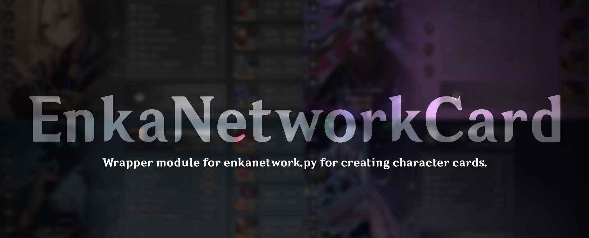
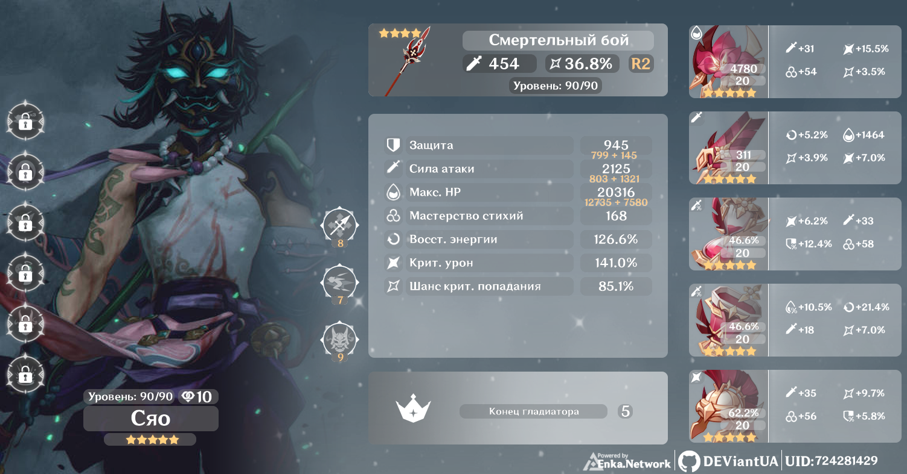
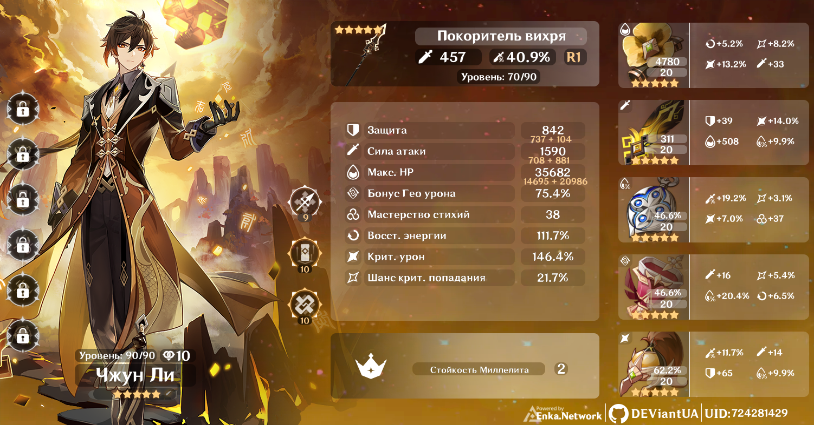
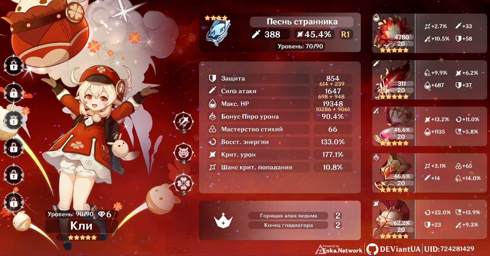

<p align="center">
 
</p>

# EnkaNetworkCard
Wrapper for [EnkaNetwork.py](https://github.com/mrwan200/EnkaNetwork.py) creation to create character cards in Python.

## Navigation
* Installation
* Dependencies
* Launch
* Description of arguments
* Languages Supported
* Sample Results

## Installation:

```
pip install enkanetworkcard
```
Or you can copy the given repository.

### Dependencies:
  Dependencies that must be installed for the library to work:
  * googletrans-3.1.0a0
  * Pillow
  * requests
  * io
  * math
  * threading
  * datetime
  * random
  * enkanetwork
  * logging

## Launch:
``` python
from enkanetworkcard import encbanner

ENC = encbanner.EnkaGenshinGeneration() 

result = ENC.start(uids = 724281429)

print(result)

```

## Description of arguments:
Main class: <code>EnkaGenshinGeneration</code> Contains the following arguments <code>lang</code>,<code>img</code>,<code>charterImg</code>,<code>name</code>,<code>adapt</code>,<code>randomImg</code>,<code>hide</code>,<code>dowload</code>

### Class argument description::
* <code>lang</code> - Takes one value to define the language. Supported languages are listed below in the documentation. The default is Russian.
* Values: str
* Example str: ```EnkaGenshinGeneration(lang = "en")```
-----
* <code>img</code> - If you want to use your image on the card, then pass this argument.
* Values str: Image link or the path to the file.
* Values PIL.ImageFile: Image opened with Image.open()
* Values list: Image link, the path to the file or PIL.ImageFile
* Example str the path to the file: ```EnkaGenshinGeneration(img = "img.png")```
* Example str image link: ```EnkaGenshinGeneration(img = "https//...image.png")```
* Example PIL.ImageFile: ```EnkaGenshinGeneration(img = Image.open("img.png"))```
* Example list: ```EnkaGenshinGeneration(img = [Image.open("img.png"), "img.png", "https//...image.png"])``` - list only works with the argument: ```randomImg```.
-----
* <code>charterImg</code> - Give each character a custom image.
* Values dict: Can take all values from the img argument except list.
* Example dict: ```EnkaGenshinGeneration(charterImg = {"Klee": Image.open("img.png"), "Albedo": "img.png", "Xiao": "https//...image.png"})```
-----
* <code>name</code> - Needed if you want to get certain characters.
* Values: str
* Example str one character: ```EnkaGenshinGeneration(name = "Klee")```
* Example str two or more characters: ```EnkaGenshinGeneration(name = "Klee, Albedo, ...")```
-----
* <code>adapt</code> - Adapt background to custom image.
* Values: bool
* Example bool: ```EnkaGenshinGeneration(img = "img.png", adapt = True)```
-----
* <code>randomImg</code> - Random selection of custom images from the list.
* Values: bool
* Example bool: ```EnkaGenshinGeneration(img = [Image.open("img.png"), "img.png"], randomImg = True)``` - If img is not a list, then randomImg is ignored.
-----
* <code>hide</code> - Hide the UID on the character card.
* Values: bool
* Example bool: ```EnkaGenshinGeneration(hide = True)```
-----
* <code>dowload</code> - Will return ready images for further work with them. (If not specified, then the finished results will be saved in the directory of the executable file in the folder and return None: ```EnkaImg```)
* Values: bool
* Example bool: ```EnkaGenshinGeneration(dowload = True)```
-----
The main function of the class: <code>start</code> takes a ```uids``` argument
### Function argument description::
* ```uids``` - Game UID in the game Genshin Impact.
* Values: int, str
* Example int: ```EnkaGenshinGeneration().start(uids = 757562748)```
* Example str one UID: ```EnkaGenshinGeneration().start(uids = "757562748")```
* Example str two or more UID: ```EnkaGenshinGeneration().start(uids = "757562748,544523587,874385763")```


## Languages Supported
| Languege    |  Code   |
|-------------|---------|
|  English    |     en  |
|  русский    |     ru  |
|  Tiếng Việt |     vi  |
|  ไทย        |     th  |
|  português  |     pt  |
|  한국어      |     kr  |
|  日本語      |     jp  |
|  中文        |     zh  |
|  Indonesian |     id  |
|  français   |     fr  |
|  español    |     es  |
|  deutsch    |     de  |
|  Taiwan     |    cht  |
|  Chinese    |    chs  |

## Sample Results:

### The result of a custom images and adaptation.
  
### Usual result.
  
